hello obsidian quartz

```mermaid
architecture-beta
    group api(logos:aws-lambda)[API]

    service db(logos:aws-aurora)[Database] in api
    service disk1(logos:aws-glacier)[Storage] in api
    service disk2(logos:aws-s3)[Storage] in api
    service server(logos:aws-ec2)[Server] in api

    db:L -- R:server
    disk1:T -- B:server
    disk2:T -- B:db
```



```plantuml
@startuml Hello World
' Uncomment the line below for "dark mode" styling
'!$AWS_DARK = true

!define AWSPuml https://raw.githubusercontent.com/awslabs/aws-icons-for-plantuml/v20.0/dist
!include AWSPuml/AWSCommon.puml
!include AWSPuml/BusinessApplications/all.puml
!include AWSPuml/Storage/SimpleStorageService.puml

actor "Person" as personAlias
WorkDocs(desktopAlias, "Label", "Technology", "Optional Description")
SimpleStorageService(storageAlias, "Label", "Technology", "Optional Description")

personAlias --> desktopAlias
desktopAlias --> storageAlias

@enduml

```
