# Make enable Mermaid using Icons
## using iconify packages.

`npm i @iconify-json/logos`

edit 'quartz/components/scripts/mermaid.inline.ts'

```typescript
/// Top of Contents

import { icons } from "@iconify-json/logos"

  

document.addEventListener("nav", async () => {

const { default: mermaid } = await import(

// @ts-ignore
"https://cdnjs.cloudflare.com/ajax/libs/mermaid/11.4.0/mermaid.esm.min.mjs"

)


mermaid.registerIconPacks([

{

name: icons.prefix,
icons,

},

])

})


/// rest of contents

```

and write mermaid code.

```
architecture-beta
    group api(logos:aws-lambda)[API]

    service db(logos:aws-aurora)[Database] in api
    service disk1(logos:aws-glacier)[Storage] in api
    service disk2(logos:aws-s3)[Storage] in api
    service server(logos:aws-ec2)[Server] in api

    db:L -- R:server
    disk1:T -- B:server
    disk2:T -- B:db
```


you can see mermaid diagram with aws icons in quartz!


```mermaid
architecture-beta
    group api(logos:aws-lambda)[API]

    service db(logos:aws-aurora)[Database] in api
    service disk1(logos:aws-glacier)[Storage] in api
    service disk2(logos:aws-s3)[Storage] in api
    service server(logos:aws-ec2)[Server] in api

    db:L -- R:server
    disk1:T -- B:server
    disk2:T -- B:db
```

```plantuml
@startuml Hello World
' Uncomment the line below for "dark mode" styling
'!$AWS_DARK = true

!define AWSPuml https://raw.githubusercontent.com/awslabs/aws-icons-for-plantuml/v20.0/dist
!include AWSPuml/AWSCommon.puml
!include AWSPuml/BusinessApplications/all.puml
!include AWSPuml/Storage/SimpleStorageService.puml

actor "Person" as personAlias
WorkDocs(desktopAlias, "Label", "Technology", "Optional Description")
SimpleStorageService(storageAlias, "Label", "Technology", "Optional Description")

personAlias --> desktopAlias
desktopAlias --> storageAlias

@enduml

```
