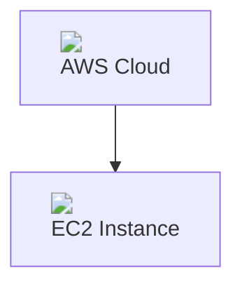

hello obsidian quartz

```mermaid
flowchart TD
  A[<img src="https://raw.githubusercontent.com/aws-samples/aws-icons-for-plantuml/main/dist/AWS-Cloud.svg" width="30"/> AWS Cloud]
  B[<img src="https://raw.githubusercontent.com/aws-samples/aws-icons-for-plantuml/main/dist/Amazon-EC2.svg" width="30"/> EC2 Instance]
  A --> B
```
